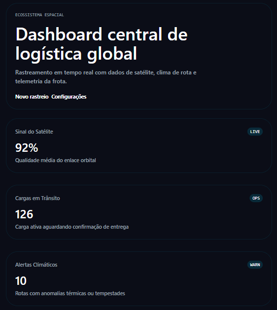
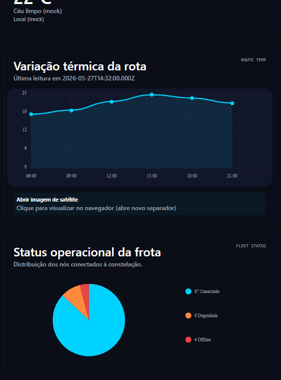
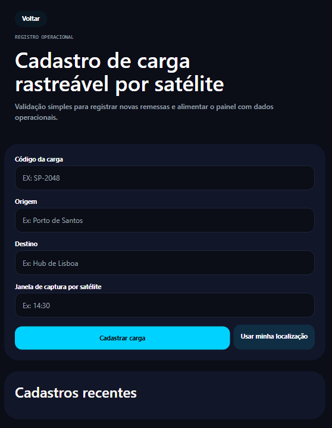
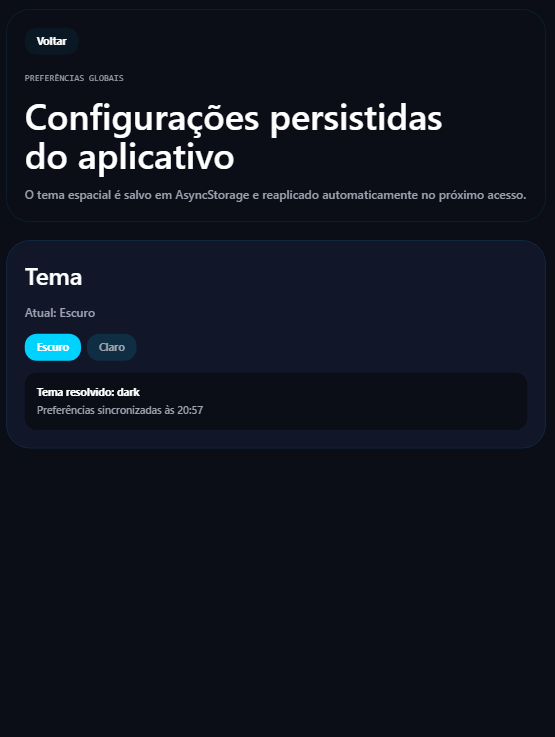

# 📱 Space Dashboard

## a) Sobre o Projeto

**Nome do app:** Space Dashboard

**Descrição do problema que resolve:** facilita o monitoramento e a gestão logística de operações espaciais — reunindo telemetria, status de satélites, registro de cargas e informações meteorológicas em um único painel para apoiar decisões de envio/recebimento de cargas.

**Funcionalidades implementadas:**
	- Dashboard com métricas e gráficos (status de satélites, distribuição de cargas).
	- Formulário de registro de cargas com validação e persistência local (`AsyncStorage`).
	- Visualizador de imagens de satélite (mock) e modal de detalhes.
	- Context API para preferências (tema) com persistência.
	- Integração básica de clima (serviço mock/OpenWeather) exibida no `WeatherCard`.
	- Navegação entre telas via `expo-router` (Home, Tracking, Settings, Explore).


## b) Integrantes do Grupo

* Enzo Almeida - RM556900
* Guilherme Moreira - RM557290
* Gabriel Guilherme - RM558638
* Gabriel de Mello - RM554421
* José Kretzer - RM555523
  
## c) Como Rodar o Projeto

Pré-requisitos:

- Node.js instalado em sua máquina.
- Aplicativo Expo Go instalado no seu dispositivo móvel (Android ou iOS).

Passo a passo para execução local:

1. Clone este repositório para a sua máquina:

```bash
git clone https://github.com/enzoalmeiida/gs-space-dashboard-2026.git
```

2. Acesse o diretório do projeto:

```bash
cd gs-space-dashboard
```

3. Instale as dependências do projeto:

```bash
npm install
```

4. Inicie o servidor do Expo:

```bash
npx expo start
```

5. Abra o aplicativo Expo Go no seu celular e escaneie o QR Code exibido no terminal.

## d) Demonstração

- https://youtu.be/ktCoaHc0CvQ
- ### 📸 Telas do App

| DashBoard Principal | Satélite | Novo Rastreio | Configurações |
| :---: | :---: | :---: | :---: |
|  |  |  |  |

## e) Decisões Técnicas

- Plataforma: Expo (SDK ~56) para compatibilidade multiplataforma e desenvolvimento rápido.
- Roteamento: `expo-router` (file-based routing) para estruturar telas em `src/app`.
- Estado global: Context API (`src/context/app-preferences-context.tsx`) para tema e preferências.
- Persistência: `@react-native-async-storage/async-storage` para salvar histórico de cargas e preferências.
- Gráficos: `react-native-chart-kit` + `react-native-svg` para visualizações simples.
- Animações: `react-native-reanimated` para animações compatíveis com web e nativo.
- Localização: `expo-location` importado dinamicamente em `src/components/tracking-form.tsx` para evitar bundling em web; fallback para `navigator.geolocation` no web.
- Testes: Jest + ts-jest para testes unitários (`src/__tests__/validation.test.ts`).

## f) Próximos Passos

- Incluir prints/screenshots em `assets/screenshots/` e referenciá-los no README.
- Gravar vídeo de demonstração (até 3 minutos) e adicionar o link em `entrega.txt`.
- Expandir testes unitários e adicionar coverage ao CI.
- Melhorar fluxos de permissão (localização) com UX mais clara.
- Integrar uma API real de imagens de satélite / telemetria para dados reais.


---

